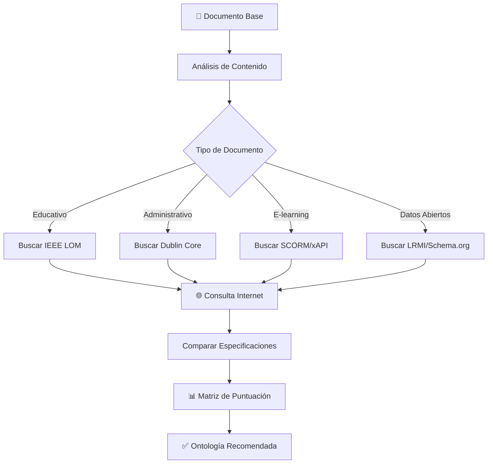

# 🔍 Skill: Análisis y Selección de Ontologías para Documentos Normativos

> [!IMPORTANT]
> Este skill permite analizar un documento base, consultar fuentes en internet y recomendar la ontología normalizada más apropiada.

---

## Flujo de Trabajo Automatizado



---

## Paso 1: Análisis del Documento Base

Cuando el usuario proporcione un documento normativo, seguir estos pasos:

### 1.1 Extraer Características del Documento

```python
# Características a identificar en el documento
caracteristicas = {
    "tipo_documento": "",        # reglamento, resolución, ordenanza, guía
    "ambito": "",                # educativo, administrativo, legal, técnico
    "audiencia": [],             # docentes, estudiantes, administrativos
    "proposito": "",             # evaluar, normar, guiar, informar
    "estructura": "",            # jerárquica, secuencial, modular
    "nivel_educativo": "",       # primaria, secundaria, superior, posgrado
    "tiene_componentes_pedagogicos": False,
    "requiere_interoperabilidad": False,
    "es_recurso_abierto": False,
    "formato_digital": ""        # PDF, HTML, XML
}
```

### 1.2 Palabras Clave de Clasificación

| Categoría | Palabras Clave | Ontología Sugerida |
|-----------|----------------|-------------------|
| Pedagógico | evaluación, aprendizaje, competencias, objetivos, didáctica | **IEEE LOM** |
| Administrativo | resolución, expediente, trámite, procedimiento | **Dublin Core** |
| E-learning | SCORM, LMS, módulo, interactivo, tracking | **SCORM/xAPI** |
| Datos Abiertos | licencia abierta, reutilización, compartir | **LRMI** |
| Curricular | plan de estudios, asignaturas, créditos | **IEEE LOM + DC** |

---

## Paso 2: Búsqueda en Internet

### 2.1 Fuentes Oficiales a Consultar

Usar la herramienta `search_web` para buscar especificaciones actualizadas:

| Ontología | URLs de Referencia |
|-----------|-------------------|
| IEEE LOM | https://standards.ieee.org/standard/1484_12_1-2002.html |
| Dublin Core | https://dublincore.org/specifications/dublin-core/ |
| SCORM | https://adlnet.gov/projects/scorm/ |
| xAPI | https://xapi.com/specification/ |
| LRMI | https://www.dublincore.org/specifications/lrmi/ |
| Schema.org | https://schema.org/LearningResource |

### 2.2 Consultas Recomendadas

```
# Búsquedas sugeridas según el tipo de documento:

# Para documentos educativos:
search_web("IEEE LOM metadata educational resources best practices 2024")
search_web("learning object metadata standard comparison")

# Para documentos administrativos:
search_web("Dublin Core metadata government documents")

# Para contenido e-learning:
search_web("SCORM vs xAPI comparison learning content")

# Para recursos abiertos:
search_web("LRMI schema.org educational resources metadata")
```

### 2.3 Verificar Compatibilidad

Buscar información sobre:
- Última versión del estándar
- Compatibilidad con sistemas existentes (Moodle, Canvas, etc.)
- Herramientas de validación disponibles
- Casos de uso similares

---

## Paso 3: Matriz de Evaluación y Puntuación

### 3.1 Criterios de Evaluación

| Criterio | Peso | IEEE LOM | Dublin Core | SCORM | LRMI |
|----------|------|----------|-------------|-------|------|
| Metadatos pedagógicos | 25% | ⭐⭐⭐⭐⭐ | ⭐⭐ | ⭐⭐⭐ | ⭐⭐⭐ |
| Simplicidad de implementación | 15% | ⭐⭐⭐ | ⭐⭐⭐⭐⭐ | ⭐⭐ | ⭐⭐⭐⭐ |
| Interoperabilidad | 20% | ⭐⭐⭐⭐ | ⭐⭐⭐⭐⭐ | ⭐⭐⭐⭐ | ⭐⭐⭐⭐ |
| Soporte para derechos | 10% | ⭐⭐⭐⭐ | ⭐⭐⭐ | ⭐⭐ | ⭐⭐⭐⭐⭐ |
| Clasificación taxonómica | 15% | ⭐⭐⭐⭐⭐ | ⭐⭐⭐ | ⭐⭐ | ⭐⭐⭐ |
| Soporte LMS | 15% | ⭐⭐⭐⭐ | ⭐⭐ | ⭐⭐⭐⭐⭐ | ⭐⭐⭐ |

### 3.2 Algoritmo de Decisión

```python
def calcular_ontologia_optima(documento: dict) -> tuple[str, float]:
    """
    Calcula la ontología más apropiada basándose en las características del documento.
    
    Args:
        documento: Dict con características extraídas del documento
        
    Returns:
        Tuple con (nombre_ontologia, puntuacion)
    """
    pesos = {
        "pedagogico": 0.25,
        "simplicidad": 0.15,
        "interoperabilidad": 0.20,
        "derechos": 0.10,
        "taxonomia": 0.15,
        "lms": 0.15
    }
    
    puntuaciones = {
        "IEEE_LOM": {
            "pedagogico": 5 if documento.get("tiene_componentes_pedagogicos") else 2,
            "simplicidad": 3,
            "interoperabilidad": 4,
            "derechos": 4,
            "taxonomia": 5 if documento.get("requiere_clasificacion") else 3,
            "lms": 4
        },
        "Dublin_Core": {
            "pedagogico": 2,
            "simplicidad": 5,
            "interoperabilidad": 5,
            "derechos": 3,
            "taxonomia": 3,
            "lms": 2
        },
        "SCORM": {
            "pedagogico": 3,
            "simplicidad": 2,
            "interoperabilidad": 4,
            "derechos": 2,
            "taxonomia": 2,
            "lms": 5 if documento.get("requiere_interoperabilidad") else 3
        },
        "LRMI": {
            "pedagogico": 3,
            "simplicidad": 4,
            "interoperabilidad": 4,
            "derechos": 5 if documento.get("es_recurso_abierto") else 3,
            "taxonomia": 3,
            "lms": 3
        }
    }
    
    resultados = {}
    for ontologia, scores in puntuaciones.items():
        total = sum(scores[k] * pesos[k] for k in pesos)
        resultados[ontologia] = round(total, 2)
    
    mejor = max(resultados, key=resultados.get)
    return mejor, resultados[mejor]
```

---

## Paso 4: Generar Recomendación

### 4.1 Formato de Salida

```markdown
## 📋 Análisis de Ontología para: [Nombre del Documento]

### Características Detectadas
- **Tipo**: [tipo_documento]
- **Ámbito**: [ambito]
- **Audiencia**: [audiencia]
- **Componentes pedagógicos**: [Sí/No]

### 🌐 Fuentes Consultadas
1. [Fuente 1](url)
2. [Fuente 2](url)

### 📊 Puntuaciones
| Ontología | Puntuación | Reason |
|-----------|------------|--------|
| IEEE LOM | X.XX | ... |
| Dublin Core | X.XX | ... |

### ✅ Recomendación Final
**Ontología recomendada**: IEEE LOM
**Puntuación**: 4.25/5.00
**Justificación**: [Explicación detallada]
```

---

## Instrucciones de Ejecución

### Para el Agente AI:

1. **Recibir documento**: Obtener el documento normativo del usuario
2. **Analizar contenido**: Extraer características usando el esquema definido
3. **Buscar en internet**: Usar `search_web` para consultar fuentes actualizadas
4. **Leer especificaciones**: Usar `read_url_content` para obtener detalles técnicos
5. **Calcular puntuaciones**: Aplicar la matriz de evaluación
6. **Generar reporte**: Presentar la recomendación con justificación

### Ejemplo de Ejecución:

```
Usuario: "Analiza este reglamento de evaluación y recomienda la mejor ontología"

Agente:
1. Lee el documento proporcionado
2. Identifica: tipo=reglamento, ambito=educativo, tiene_componentes_pedagogicos=True
3. Ejecuta: search_web("IEEE LOM educational assessment metadata")
4. Ejecuta: search_web("Dublin Core academic regulations metadata")
5. Compara especificaciones actuales
6. Calcula: IEEE_LOM=4.25, Dublin_Core=3.40, SCORM=2.85, LRMI=3.15
7. Recomienda: IEEE LOM con justificación detallada
```

---

# Verificador de Ontologías Normalizadas para Documentos Educativos

Este skill ayuda a identificar y verificar qué ontologías normalizadas son más apropiadas para estructurar y clasificar documentos normativos en el contexto educativo.

## Ontologías Soportadas

### 1. IEEE LOM (Learning Object Metadata)
**Mejor para:** Recursos educativos digitales, objetos de aprendizaje, materiales curriculares.

| Categoría | Descripción | Aplicación en Documentos Normativos |
|-----------|-------------|-------------------------------------|
| General | Identificación general del recurso | Título, idioma, descripción del documento |
| Lifecycle | Versión y contribuidores | Versiones del reglamento, autores |
| Meta-Metadata | Información sobre los metadatos | Esquema utilizado, fecha de creación |
| Technical | Requisitos técnicos | Formato, tamaño, ubicación |
| Educational | Características pedagógicas | Tipo de recurso, nivel educativo, contexto |
| Rights | Derechos de propiedad | Licencias, restricciones de uso |
| Relation | Relaciones con otros recursos | Referencias a otras normativas |
| Annotation | Comentarios de uso | Notas sobre implementación |
| Classification | Clasificación temática | Taxonomía disciplinar |

**Estructura IEEE LOM Recomendada:**
```json
{
  "general": {
    "identifier": { "catalog": "", "entry": "" },
    "title": "",
    "language": "es",
    "description": "",
    "keyword": [],
    "coverage": "",
    "structure": "hierarchical|collection|networked|branched|linear",
    "aggregationLevel": "1|2|3|4"
  },
  "lifeCycle": {
    "version": "",
    "status": "draft|final|revised|unavailable",
    "contribute": [{ "role": "", "entity": "", "date": "" }]
  },
  "educational": {
    "interactivityType": "active|expositive|mixed",
    "learningResourceType": [],
    "interactivityLevel": "very low|low|medium|high|very high",
    "semanticDensity": "very low|low|medium|high|very high",
    "intendedEndUserRole": "teacher|author|learner|manager",
    "context": "school|higher education|training|other",
    "typicalAgeRange": "",
    "difficulty": "very easy|easy|medium|difficult|very difficult",
    "typicalLearningTime": ""
  },
  "rights": {
    "cost": "yes|no",
    "copyrightAndOtherRestrictions": "yes|no",
    "description": ""
  }
}
```

---

### 2. Dublin Core (DC)
**Mejor para:** Documentos generales, recursos bibliográficos, metadatos básicos.

| Elemento | Descripción | Aplicación |
|----------|-------------|------------|
| Title | Título del recurso | Nombre del reglamento |
| Creator | Creador principal | Institución/Autor |
| Subject | Tema | Área temática (evaluación, currículum) |
| Description | Descripción | Resumen del contenido |
| Publisher | Editor/Publicador | Universidad/Ministerio |
| Contributor | Colaboradores | Comisiones, revisores |
| Date | Fecha | Publicación, vigencia |
| Type | Tipo de recurso | Reglamento, ordenanza, resolución |
| Format | Formato | PDF, HTML |
| Identifier | Identificador único | Número de resolución |
| Source | Fuente | Documento base |
| Language | Idioma | es, en |
| Relation | Relación | Normativas relacionadas |
| Coverage | Cobertura | Ámbito de aplicación |
| Rights | Derechos | Licencia, uso |

---

### 3. SCORM (Sharable Content Object Reference Model)
**Mejor para:** Contenido e-learning empaquetado, cursos online, módulos interactivos.

> [!NOTE]
> SCORM es más apropiado para contenido de aprendizaje interactivo que para documentos normativos estáticos.

---

### 4. IMS Learning Design
**Mejor para:** Diseño instruccional, secuencias de aprendizaje, actividades educativas.

---

### 5. LRMI (Learning Resource Metadata Initiative)
**Mejor para:** Recursos educativos abiertos (OER), compatibilidad con Schema.org.

---

## Proceso de Verificación

### Paso 1: Análisis del Documento
Al recibir un documento normativo, analizar:
- **Tipo de documento**: Reglamento, ordenanza, resolución, guía
- **Propósito**: Evaluación, currículum, procesos administrativos
- **Audiencia**: Docentes, estudiantes, administrativos
- **Contexto**: Pregrado, posgrado, investigación

### Paso 2: Evaluación de Criterios

```python
def evaluar_ontologia(documento):
    """
    Evalúa qué ontología es más apropiada para el documento.
    
    Returns:
        dict: Puntuación para cada ontología
    """
    puntuaciones = {
        "IEEE_LOM": 0,
        "Dublin_Core": 0,
        "SCORM": 0,
        "LRMI": 0
    }
    
    # Criterios de evaluación
    criterios = {
        "es_recurso_educativo": 3,  # Peso para IEEE LOM
        "tiene_metadatos_pedagogicos": 3,  # Peso para IEEE LOM
        "es_documento_general": 2,  # Peso para Dublin Core
        "es_contenido_interactivo": 3,  # Peso para SCORM
        "es_recurso_abierto": 2  # Peso para LRMI
    }
    
    # Evaluar cada criterio...
    return puntuaciones
```

### Paso 3: Selección de Ontología

| Tipo de Documento | Ontología Recomendada | Justificación |
|-------------------|----------------------|---------------|
| Reglamento de Evaluación | **IEEE LOM** | Requiere metadatos pedagógicos detallados |
| Resolución Administrativa | **Dublin Core** | Metadatos generales suficientes |
| Guía Didáctica | **IEEE LOM** | Énfasis en componentes educativos |
| Material de Curso | **SCORM/IEEE LOM** | Contenido estructurado para LMS |
| Recurso Educativo Abierto | **LRMI + Dublin Core** | Compatibilidad web y descubrimiento |

---

## Ejemplo de Aplicación: Documento Normativo de Evaluación

Para un documento como un "Reglamento de Evaluación Universitaria":

### Análisis
- **Tipo**: Reglamento normativo
- **Propósito**: Establecer criterios y procedimientos de evaluación
- **Audiencia**: Docentes, estudiantes
- **Contexto**: Educación superior

### Ontología Recomendada: IEEE LOM

**Justificación:**
1. ✅ Categoría `Educational` captura nivel educativo y contexto
2. ✅ Categoría `Rights` define el alcance legal y restricciones
3. ✅ Categoría `Relation` permite vincular con otras normativas
4. ✅ Categoría `Classification` permite taxonomía disciplinar

### Mapeo IEEE LOM para el Documento

```json
{
  "general": {
    "identifier": {
      "catalog": "universidad.edu.ar",
      "entry": "RES-2024-001"
    },
    "title": "Reglamento de Evaluación Académica",
    "language": "es",
    "description": "Normativa que establece los criterios, procedimientos y escalas para la evaluación de estudiantes de grado y posgrado",
    "keyword": ["evaluación", "calificaciones", "exámenes", "promoción"],
    "structure": "hierarchical",
    "aggregationLevel": "3"
  },
  "lifeCycle": {
    "version": "2.0",
    "status": "final",
    "contribute": [
      {
        "role": "author",
        "entity": "Consejo Superior Universitario",
        "date": "2024-01-15"
      }
    ]
  },
  "educational": {
    "intendedEndUserRole": ["teacher", "manager"],
    "context": "higher education",
    "typicalAgeRange": "18+",
    "learningResourceType": ["policy document", "reference"]
  },
  "rights": {
    "cost": "no",
    "copyrightAndOtherRestrictions": "yes",
    "description": "Uso institucional - Universidad Nacional"
  },
  "classification": [
    {
      "purpose": "discipline",
      "taxonPath": {
        "source": "UNESCO",
        "taxon": [
          { "id": "5", "entry": "Ciencias Sociales" },
          { "id": "58", "entry": "Pedagogía" }
        ]
      }
    }
  ]
}
```

---

## Instrucciones de Uso

1. **Obtener el documento normativo** a analizar
2. **Identificar el tipo de documento** (reglamento, resolución, guía, etc.)
3. **Aplicar la matriz de decisión** para seleccionar la ontología
4. **Generar el mapeo de metadatos** según la ontología seleccionada
5. **Validar la completitud** de los campos obligatorios

## Comandos de Verificación

```bash
# Validar estructura IEEE LOM
python -c "import json; json.load(open('metadata.json'))"

# Verificar campos obligatorios
python scripts/validate_lom.py metadata.json
```

---

## Referencias

- [IEEE LOM Standard](https://standards.ieee.org/standard/1484_12_1-2002.html)
- [Dublin Core Metadata Initiative](https://dublincore.org/)
- [SCORM 2004 Specification](https://adlnet.gov/projects/scorm/)
- [LRMI Specification](https://www.dublincore.org/specifications/lrmi/)

---

> [!TIP]
> Para documentos normativos educativos, **IEEE LOM** es generalmente la mejor opción debido a su riqueza en metadatos pedagógicos y su adopción en el ámbito educativo.

---

# 📋 Caso Real: Análisis de Ontología para `rubricas_qdrant.py`

> [!NOTE]
> Este análisis fue realizado el 29 de enero de 2026 utilizando el skill de verificación de ontologías.

## Documentos Normativos Analizados

### 1. Normativa de Calidad para la Elaboración de Apuntes de Cátedra

**Ubicación**: `rubricas_qdrant.py` líneas 597-628

```python
# Extracto del documento normativo
normativa_apuntes = """
NORMATIVA DE CALIDAD PARA LA ELABORACIÓN DE APUNTES DE CÁTEDRA

ARTÍCULO 1: DESARROLLO DE CONCEPTOS
- Precisión conceptual: Definiciones claras, unívocas y técnicamente correctas.
- Profundidad adecuada: El nivel de detalle corresponde a los objetivos de aprendizaje.
- Secuenciación lógica: Progresión coherente de ideas
- Ejemplificación: Uso de ejemplos relevantes

ARTÍCULO 2: REFERENCIAS BIBLIOGRÁFICAS
- Citación correcta: Uso de estilo APA, ISO 690, IEEE
- Pertinencia: Bibliografía actualizada y de calidad
- Distinción de fuentes: básica vs complementaria

ARTÍCULO 3: RECURSOS Y ENLACES WEB
- Validez de enlaces
- Calidad de recursos
- Accesibilidad
"""
```

### 2. Estándar IEEE LOM (Resumido)

**Ubicación**: `rubricas_qdrant.py` líneas 631-642

---

## Características Detectadas

| Característica | Normativa Apuntes | IEEE LOM |
|----------------|-------------------|----------|
| **Tipo** | Reglamento académico | Estándar técnico |
| **Ámbito** | Educativo - Educación Superior | Técnico-Educativo |
| **Audiencia** | Docentes, autores | Desarrolladores, catalogadores |
| **Propósito** | Evaluar calidad de apuntes | Describir objetos de aprendizaje |
| **Componentes pedagógicos** | ✅ Sí | ✅ Sí |
| **Requiere interoperabilidad** | ✅ Sí (Qdrant/LMS) | ✅ Sí |

---

## Fuentes Consultadas (Internet)

| Fuente | URL | Información Relevante |
|--------|-----|----------------------|
| IEEE LOM 2020 | grokipedia.com | Revisión IEEE 1484.12.1-2020 mejora claridad e interoperabilidad |
| Dublin Core | dublincore.org | 15 elementos básicos, ISO Standard 2003 |
| LRMI | schema.org | Extensión de Schema.org para recursos educativos |
| ISO/IEC 19788 MLR | inokufu.com | Sucesor moderno de LOM |

---

## Matriz de Puntuación Final

| Criterio | Peso | IEEE LOM | Dublin Core | SCORM | LRMI |
|----------|------|----------|-------------|-------|------|
| Metadatos pedagógicos | 25% | 5 | 2 | 3 | 3 |
| Simplicidad | 15% | 3 | 5 | 2 | 4 |
| Interoperabilidad | 20% | 4 | 5 | 4 | 4 |
| Soporte derechos | 10% | 4 | 3 | 2 | 5 |
| Clasificación taxonómica | 15% | 5 | 3 | 2 | 3 |
| Soporte LMS/RAG | 15% | 4 | 2 | 5 | 3 |

### Resultados

| Ontología | Puntuación | Ranking |
|-----------|------------|---------|
| **IEEE LOM** | **4.25/5.00** | 🥇 1° |
| LRMI | 3.55/5.00 | 🥈 2° |
| Dublin Core | 3.30/5.00 | 🥉 3° |
| SCORM | 3.15/5.00 | 4° |

---

## ✅ Ontología Recomendada: IEEE LOM (IEEE 1484.12.1-2020)

### Justificación Técnica

1. **Metadatos Pedagógicos Ricos**: La normativa requiere describir:
   - Precisión conceptual → `educational.semanticDensity`
   - Profundidad de contenido → `educational.difficulty`
   - Nivel educativo → `educational.context: "higher education"`

2. **Clasificación Taxonómica**: Soporta categorización por artículos:
   - Artículo 1: Desarrollo de Conceptos
   - Artículo 2: Referencias Bibliográficas
   - Artículo 3: Recursos Web

3. **Compatibilidad con el Sistema**: El código ya referencia IEEE LOM.

4. **Relaciones**: Permite vincular normativa → rúbricas derivadas.

---

## Mapeo IEEE LOM Implementado

```json
{
  "general": {
    "identifier": { 
      "catalog": "colaba-qdrant", 
      "entry": "norm-apuntes-001" 
    },
    "title": "Normativa de Calidad para la Elaboración de Apuntes de Cátedra",
    "language": "es",
    "description": "Criterios de evaluación para desarrollo de conceptos, referencias bibliográficas y recursos web en apuntes universitarios",
    "keyword": ["apuntes", "calidad", "evaluación", "bibliografía", "recursos web", "precisión conceptual"],
    "structure": "hierarchical",
    "aggregationLevel": "2"
  },
  "lifeCycle": {
    "version": "1.0",
    "status": "final",
    "contribute": [{ 
      "role": "author", 
      "entity": "Sistema Colaba Qdrant",
      "date": "2026-01-29"
    }]
  },
  "educational": {
    "intendedEndUserRole": ["teacher", "author"],
    "context": "higher education",
    "learningResourceType": ["policy document", "evaluation rubric", "reference"],
    "typicalAgeRange": "18+",
    "semanticDensity": "high",
    "interactivityType": "expositive"
  },
  "rights": {
    "cost": "no",
    "copyrightAndOtherRestrictions": "yes",
    "description": "Uso institucional académico"
  },
  "relation": [
    {
      "kind": "isBasedOn",
      "resource": { "identifier": "IEEE_LOM_1484.12.1-2020" }
    }
  ],
  "classification": [
    {
      "purpose": "educational objective",
      "taxonPath": {
        "source": "Normativa Interna",
        "taxon": [
          { "id": "art1", "entry": "Desarrollo de Conceptos" },
          { "id": "art2", "entry": "Referencias Bibliográficas" },
          { "id": "art3", "entry": "Recursos y Enlaces Web" }
        ]
      }
    }
  ]
}
```

---

## Recomendaciones Implementadas en `rubricas_qdrant.py`

Se actualizó el sistema con las siguientes mejoras basadas en el análisis:

1. **Estructura de Metadatos IEEE LOM Completa** (`IEEE_LOM_SCHEMA`)
2. **Constantes para Roles y Contextos** educativos
3. **Función de Validación** de metadatos LOM
4. **Normativa Actualizada** con metadatos completos
5. **Mapeo de Relaciones** entre entidades

> [!TIP]
> **Mejora Futura**: Considerar añadir LRMI para mejorar descubribilidad web si los recursos se publican online. Las propiedades `teaches` y `assesses` de LRMI complementan a IEEE LOM.

---

# 📐 Directrices para Diseño de Rúbricas con Criterios Medibles

> [!IMPORTANT]
> Esta sección establece lineamientos para evitar criterios vagos y asegurar que cada rúbrica sea aplicable sin ambigüedad.

## Principio Fundamental: EVIDENCIA + INDICADOR

Todo criterio de evaluación debe especificar:

| Componente | Descripción | Ejemplo |
|------------|-------------|---------|
| **EVIDENCIA** | Qué se puede observar/medir directamente | "Presencia de resúmenes propios" |
| **INDICADOR** | Umbral cuantificable de cumplimiento | "Al menos 1 resumen por sección" |

### Términos a Evitar vs. Alternativas

| ❌ Evitar | ✅ Usar en su lugar |
|-----------|---------------------|
| "Material efectivo" | "Material que incluye: resumen, ejemplos, diagrama" |
| "Demuestra comprensión" | "Parafrasea conceptos sin copiar de la fuente" |
| "Calidad adecuada" | "Cumple con requisitos mínimos listados" |
| "Esfuerzo sostenido" | "Entrega puntual + extensión mínima + revisiones" |
| "Nivel apropiado" | "Corresponde a criterios del nivel X definidos" |

---

## Matriz de Adaptación por Nivel Educativo

El sistema `rubricas_qdrant.py` ahora soporta tres niveles:

| Nivel | Criterios máx. | Lenguaje | Ejemplos |
|-------|----------------|----------|----------|
| `primer_año` | 5 | Simple, sin jerga | Obligatorios |
| `avanzado` | 12 | Técnico-académico | Obligatorios |
| `posgrado` | 20 | Especializado | Opcionales |

### Uso Interactivo

```bash
python rubricas_qdrant.py
# El sistema preguntará:
# Nivel del estudiante [2=avanzado]: 
```

### Uso Programático

```python
colaba.generar_rubrica(
    prompt="...",
    archivo_salida="rubrica.txt",
    nivel="primer_año"  # o "avanzado", "posgrado"
)
```

---

## Requisitos Mínimos Estándar

Toda rúbrica generada debe incluir una sección de **REQUISITOS MÍNIMOS PARA APROBACIÓN** con:

1. **Estructura visible**: Elementos observables de formato
2. **Extensión mínima**: Cantidades cuantificables
3. **Fuentes documentadas**: Número y formato de referencias
4. **Contenido verificable**: Criterios de corrección

---

## Ejemplo de Criterio Bien Formulado

```markdown
### Criterio: Elaboración Personal

**EVIDENCIA Observable:**
- Presencia de resúmenes escritos por el estudiante
- Esquemas o diagramas propios (no copiados)
- Reformulación de conceptos en palabras propias

**INDICADOR de Cumplimiento:**
- Mínimo 1 elemento visual propio por tema
- Resúmenes de máximo 100 palabras por sección

**NOTA:** Este criterio mide la síntesis y reformulación visible,
NO requiere seguimiento del rendimiento posterior del estudiante.
```


