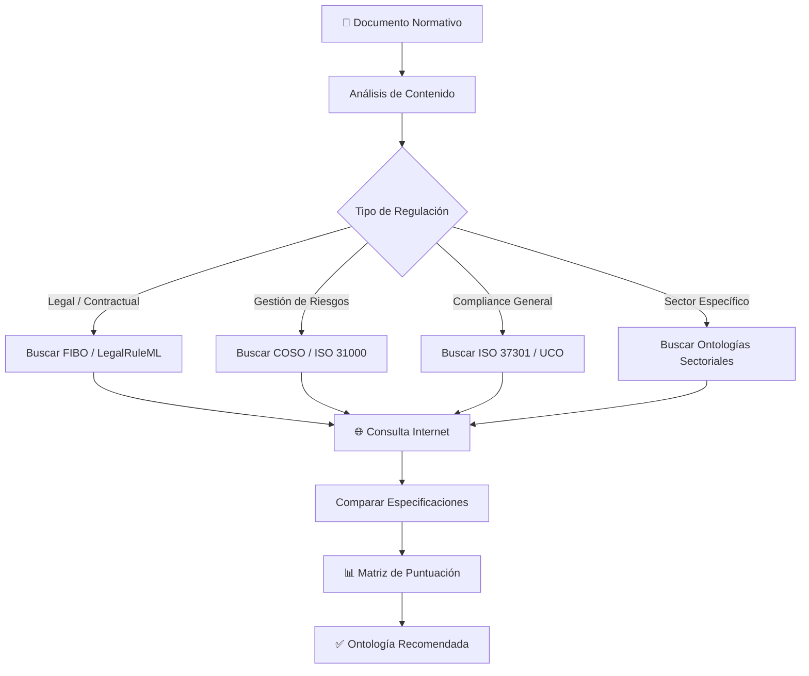

# 🔍 Skill: Análisis y Selección de Ontologías para Cumplimiento Normativo

> [!IMPORTANT]
> Este skill permite analizar un documento regulatorio o normativo, consultar fuentes en internet y recomendar la ontología normalizada más apropiada para estructurar rúbricas de cumplimiento.

---

## Flujo de Trabajo Automatizado


```mermaid
flowchart TD
    A[📄 Documento Normativo] --> B[Análisis de Contenido]
    B --> C{Tipo de Regulación}
    C -->|Legal / Contractual| D[Buscar FIBO / LegalRuleML]
    C -->|Gestión de Riesgos| E[Buscar COSO / ISO 31000]
    C -->|Compliance General| F[Buscar ISO 37301 / UCO]
    C -->|Sector Específico| G[Buscar Ontologías Sectoriales]
    D --> H[🌐 Consulta Internet]
    E --> H
    F --> H
    G --> H
    H --> I[Comparar Especificaciones]
    I --> J[📊 Matriz de Puntuación]
    J --> K[✅ Ontología Recomendada]
```

---

## Paso 1: Análisis del Documento Normativo

Cuando el usuario proporcione un documento normativo, seguir estos pasos:

### 1.1 Extraer Características del Documento

```python
# Características a identificar en el documento
caracteristicas = {
    "tipo_documento": "",        # ley, reglamento, resolución, norma técnica, política
    "ambito": "",                # legal, operacional, técnico, financiero, ambiental
    "sector": "",                # financiero, salud, industrial, gubernamental, TI
    "audiencia": [],             # auditores, directivos, operadores, reguladores
    "proposito": "",             # regular, fiscalizar, certificar, controlar, mitigar
    "estructura": "",            # jerárquica, por artículos, por requisitos, modular
    "nivel_criticidad": "",      # operacional, técnico-regulatorio, alta_criticidad
    "tiene_sanciones": False,
    "requiere_evidencia": False,
    "es_certificable": False,
    "marco_referencia": ""       # ISO, COSO, Basel, NIST, sector-específico
}
```

### 1.2 Palabras Clave de Clasificación

| Categoría | Palabras Clave | Ontología Sugerida |
|-----------|----------------|-------------------|
| Legal / Regulatorio | ley, decreto, sanción, obligación, jurisdicción | **LegalRuleML / LKIF** |
| Riesgos y Controles | riesgo, control, mitigación, probabilidad, impacto | **COSO ERM / ISO 31000** |
| Compliance General | cumplimiento, auditoría, política, procedimiento | **ISO 37301 / UCO** |
| Financiero | capital, liquidez, reporte, exposición, Basel | **FIBO / FRO** |
| Seguridad / TI | vulnerabilidad, amenaza, incidente, activo | **NIST CSF / ISO 27001** |
| Ambiental / ESG | emisiones, sostenibilidad, impacto ambiental | **SASB / GRI Ontology** |

---

## Paso 2: Búsqueda en Internet

### 2.1 Fuentes Oficiales a Consultar

Usar la herramienta `search_web` para buscar especificaciones actualizadas:

| Ontología | URLs de Referencia |
|-----------|-------------------|
| LegalRuleML | https://docs.oasis-open.org/legalruleml/ |
| LKIF (Legal Knowledge) | https://github.com/RinkeHoekstra/lkif-core |
| FIBO | https://spec.edmcouncil.org/fibo/ |
| UCO (Unified Compliance) | https://www.unifiedcompliance.com/ |
| COSO ERM | https://www.coso.org/guidance-on-ic |
| ISO 37301 | https://www.iso.org/standard/75080.html |
| ISO 31000 | https://www.iso.org/iso-31000-risk-management.html |
| NIST CSF | https://www.nist.gov/cyberframework |
| Dublin Core | https://dublincore.org/specifications/dublin-core/ |
| Semantic Compliance | https://www.finregont.com/ |

### 2.2 Consultas Recomendadas

```
# Búsquedas sugeridas según el tipo de documento:

# Para documentos legales/regulatorios:
search_web("LegalRuleML ontology regulatory compliance rules representation")
search_web("LKIF core legal ontology normative reasoning")

# Para gestión de riesgos:
search_web("COSO ERM ontology risk control framework")
search_web("ISO 31000 risk management ontology")

# Para compliance general:
search_web("ISO 37301 compliance management system ontology")
search_web("unified compliance ontology framework")

# Para sector financiero:
search_web("FIBO financial industry ontology regulatory compliance")
search_web("Semantic Compliance regulatory reporting ontology")
```

### 2.3 Verificar Compatibilidad

Buscar información sobre:
- Formalización en OWL/RDF del estándar
- Compatibilidad con sistemas GRC existentes
- Herramientas de validación de cumplimiento disponibles
- Casos de uso en auditorías similares

---

## Paso 3: Matriz de Evaluación y Puntuación

### 3.1 Criterios de Evaluación

| Criterio | Peso | LegalRuleML | COSO/ISO 31000 | FIBO | ISO 37301 | Dublin Core |
|----------|------|-------------|----------------|------|-----------|-------------|
| Modelado de obligaciones | 25% | ⭐⭐⭐⭐⭐ | ⭐⭐⭐ | ⭐⭐⭐⭐ | ⭐⭐⭐⭐ | ⭐⭐ |
| Trazabilidad de evidencia | 20% | ⭐⭐⭐⭐ | ⭐⭐⭐⭐⭐ | ⭐⭐⭐ | ⭐⭐⭐⭐⭐ | ⭐⭐ |
| Interoperabilidad (OWL/RDF) | 15% | ⭐⭐⭐⭐⭐ | ⭐⭐ | ⭐⭐⭐⭐⭐ | ⭐⭐⭐ | ⭐⭐⭐⭐⭐ |
| Gestión de riesgos | 15% | ⭐⭐⭐ | ⭐⭐⭐⭐⭐ | ⭐⭐⭐⭐ | ⭐⭐⭐⭐ | ⭐⭐ |
| Simplicidad de adopción | 10% | ⭐⭐ | ⭐⭐⭐⭐ | ⭐⭐ | ⭐⭐⭐⭐ | ⭐⭐⭐⭐⭐ |
| Soporte para sanciones | 15% | ⭐⭐⭐⭐⭐ | ⭐⭐⭐ | ⭐⭐⭐⭐ | ⭐⭐⭐⭐ | ⭐ |

### 3.2 Algoritmo de Decisión

```python
def calcular_ontologia_optima(documento: dict) -> tuple[str, float]:
    """
    Calcula la ontología más apropiada basándose en las características
    del documento normativo/regulatorio.
    
    Args:
        documento: Dict con características extraídas del documento
        
    Returns:
        Tuple con (nombre_ontologia, puntuacion)
    """
    pesos = {
        "obligaciones": 0.25,
        "evidencia": 0.20,
        "interoperabilidad": 0.15,
        "riesgos": 0.15,
        "simplicidad": 0.10,
        "sanciones": 0.15
    }
    
    puntuaciones = {
        "LegalRuleML": {
            "obligaciones": 5,
            "evidencia": 4,
            "interoperabilidad": 5,
            "riesgos": 3,
            "simplicidad": 2,
            "sanciones": 5 if documento.get("tiene_sanciones") else 3
        },
        "COSO_ISO31000": {
            "obligaciones": 3,
            "evidencia": 5 if documento.get("requiere_evidencia") else 3,
            "interoperabilidad": 2,
            "riesgos": 5,
            "simplicidad": 4,
            "sanciones": 3
        },
        "FIBO": {
            "obligaciones": 4,
            "evidencia": 3,
            "interoperabilidad": 5,
            "riesgos": 4,
            "simplicidad": 2,
            "sanciones": 4 if documento.get("sector") == "financiero" else 2
        },
        "ISO_37301": {
            "obligaciones": 4,
            "evidencia": 5,
            "interoperabilidad": 3,
            "riesgos": 4,
            "simplicidad": 4,
            "sanciones": 4 if documento.get("es_certificable") else 3
        },
        "Dublin_Core": {
            "obligaciones": 2,
            "evidencia": 2,
            "interoperabilidad": 5,
            "riesgos": 2,
            "simplicidad": 5,
            "sanciones": 1
        }
    }
    
    resultados = {}
    for ontologia, scores in puntuaciones.items():
        total = sum(scores[k] * pesos[k] for k in pesos)
        resultados[ontologia] = round(total, 2)
    
    mejor = max(resultados, key=resultados.get)
    return mejor, resultados[mejor]
```

---

## Paso 4: Generar Recomendación

### 4.1 Formato de Salida

```markdown
## 📋 Análisis de Ontología para: [Nombre del Documento Normativo]

### Características Detectadas
- **Tipo**: [tipo_documento]
- **Sector**: [sector]
- **Nivel de Criticidad**: [nivel_criticidad]
- **Requiere evidencia trazable**: [Sí/No]
- **Incluye sanciones**: [Sí/No]

### 🌐 Fuentes Consultadas
1. [Fuente 1](url)
2. [Fuente 2](url)

### 📊 Puntuaciones
| Ontología | Puntuación | Razón |
|-----------|------------|-------|
| LegalRuleML | X.XX | ... |
| ISO 37301 | X.XX | ... |

### ✅ Recomendación Final
**Ontología recomendada**: [Nombre]
**Puntuación**: X.XX/5.00
**Justificación**: [Explicación detallada]
```

---

## Instrucciones de Ejecución

### Para el Agente AI:

1. **Recibir documento**: Obtener el documento normativo/regulatorio del usuario
2. **Analizar contenido**: Extraer características usando el esquema definido
3. **Buscar en internet**: Usar `search_web` para consultar fuentes actualizadas
4. **Leer especificaciones**: Usar `read_url_content` para obtener detalles técnicos
5. **Calcular puntuaciones**: Aplicar la matriz de evaluación
6. **Generar reporte**: Presentar la recomendación con justificación

### Ejemplo de Ejecución:

```
Usuario: "Analiza este reglamento de seguridad industrial y recomienda la mejor ontología"

Agente:
1. Lee el documento proporcionado
2. Identifica: tipo=reglamento, sector=industrial, tiene_sanciones=True
3. Ejecuta: search_web("LegalRuleML regulatory compliance industrial safety")
4. Ejecuta: search_web("ISO 37301 compliance management system industrial")
5. Compara especificaciones actuales
6. Calcula: LegalRuleML=4.15, ISO_37301=4.05, COSO=3.60, FIBO=2.85
7. Recomienda: LegalRuleML con justificación detallada
```

---

## Ontologías Soportadas

### 1. LegalRuleML (OASIS Standard)
**Mejor para:** Normativas con obligaciones, prohibiciones, sanciones y razonamiento lógico.

| Componente | Descripción | Aplicación en Compliance |
|------------|-------------|--------------------------|
| Statements | Reglas normativas formalizadas | Artículos de ley → reglas ejecutables |
| Deontic | Obligaciones, permisos, prohibiciones | Requisitos de cumplimiento obligatorio |
| Defeasibility | Excepciones y prioridades entre normas | Jerarquía normativa |
| Temporal | Vigencia y plazos | Fechas de cumplimiento, periodos de gracia |
| Penalties | Sanciones y consecuencias | Multas, suspensiones, inhabilitaciones |

---

### 2. COSO ERM / ISO 31000
**Mejor para:** Gestión de riesgos, controles internos, auditorías de procesos.

| Componente | Descripción | Aplicación |
|------------|-------------|------------|
| Risk Assessment | Identificación y evaluación de riesgos | Mapa de riesgos por proceso |
| Control Activities | Controles preventivos y detectivos | Evidencia de controles implementados |
| Monitoring | Supervisión continua | KPIs y métricas de cumplimiento |
| Information | Flujo de información | Trazabilidad de reportes |

> [!NOTE]
> COSO es un marco conceptual, no una ontología formal en OWL. Se usa como referencia semántica para estructurar la evaluación de controles.

---

### 3. FIBO (Financial Industry Business Ontology)
**Mejor para:** Regulación financiera (Basel, SOX, MiFID), contratos, instrumentos financieros.

| Componente | Descripción | Aplicación |
|------------|-------------|------------|
| Foundations | Entidades jurídicas, jurisdicciones | Identificación de sujetos regulados |
| Business Entities | Tipos de organizaciones | Clasificación de entidades auditadas |
| Financial Business & Commerce | Contratos y transacciones | Obligaciones contractuales |
| Securities | Instrumentos financieros | Cumplimiento de reportes regulatorios |

---

### 4. ISO 37301 (Compliance Management Systems)
**Mejor para:** Sistemas de gestión de cumplimiento certificables, políticas internas.

| Elemento | Descripción | Aplicación |
|----------|-------------|------------|
| Context | Contexto de la organización | Ámbito de aplicación de la norma |
| Leadership | Compromiso de la dirección | Roles y responsabilidades |
| Planning | Planificación del cumplimiento | Identificación de obligaciones |
| Support | Recursos y competencias | Evidencia de capacitación |
| Operation | Procesos operativos | Controles y procedimientos |
| Evaluation | Monitoreo y medición | Auditorías internas |
| Improvement | Mejora continua | Acciones correctivas |

---

### 5. Dublin Core (DC)
**Mejor para:** Metadatos básicos de catalogación de documentos normativos.

> [!TIP]
> Dublin Core es complementario a las ontologías de compliance. Se usa para catalogar y descubrir documentos, no para modelar obligaciones.

---

## Selección Rápida por Tipo de Documento

| Tipo de Documento | Ontología Recomendada | Justificación |
|-------------------|----------------------|---------------|
| Ley / Decreto | **LegalRuleML** | Modelado de obligaciones y sanciones |
| Norma ISO certificable | **ISO 37301** | Sistema de gestión de cumplimiento |
| Política de riesgos | **COSO ERM / ISO 31000** | Evaluación y control de riesgos |
| Regulación financiera | **FIBO** | Vocabulario financiero normalizado |
| Norma técnica industrial | **LegalRuleML + ISO 37301** | Requisitos técnicos + gestión |
| Reglamento interno | **ISO 37301** | Políticas y procedimientos internos |

---

## Relación con el Sistema RubricAI

Este skill se integra con el sistema de generación de rúbricas de cumplimiento normativo:

1. **Ontólogo Agent** → Usa la ontología seleccionada para extraer entidades (requisitos, obligaciones, sanciones) y relaciones (REQUIERE, REGULA, DEFINE)
2. **Rubricador Agent** → Genera la rúbrica con criterios alineados a la estructura de la ontología
3. **Evaluador Agent** → Evalúa documentos contrastándolos con la rúbrica y el contexto normativo en Qdrant
4. **Corrector Agent** → Sugiere correcciones para alinear el texto con la normativa de referencia

### Niveles de Exigencia del Sistema

| Nivel | Clave | Criterios máx. | Lenguaje | Descripción |
|-------|-------|----------------|----------|-------------|
| Operacional (Básico) | `inicial` | 6 | Directo, enfocado en procesos | Verificación rápida de procesos operativos |
| Técnico/Regulatorio | `avanzado` | 12 | Técnico preciso | Auditoría de cumplimiento técnico o normativo |
| Alta Criticidad (Legal) | `critico` | 20 | Formal, legalmente riguroso | Cumplimiento legal o de alta seguridad |

---

## 📐 Directrices para Diseño de Rúbricas con Criterios Medibles

> [!IMPORTANT]
> Toda rúbrica de cumplimiento debe evitar criterios vagos y asegurar que cada área sea verificable mediante evidencia observable.

### Principio Fundamental: EVIDENCIA + INDICADOR

| Componente | Descripción | Ejemplo |
|------------|-------------|---------|
| **EVIDENCIA** | Qué se puede observar/verificar directamente | "Registro de auditoría firmado" |
| **INDICADOR** | Umbral cuantificable de cumplimiento | "100% de registros firmados en plazo" |

### Términos a Evitar vs. Alternativas

| ❌ Evitar | ✅ Usar en su lugar |
|-----------|---------------------|
| "Cumplimiento adecuado" | "Cumple con los X requisitos listados en Art. Y" |
| "Gestión efectiva" | "Registro de acciones correctivas cerradas en < 30 días" |
| "Nivel apropiado" | "Cumple umbrales definidos en la tabla de requisitos mínimos" |
| "Control suficiente" | "Evidencia de al menos N controles documentados por proceso" |
| "Buenas prácticas" | "Prácticas alineadas con [norma específica], secciones X-Y" |

### Requisitos Mínimos Estándar

Toda rúbrica generada debe incluir una sección de **REQUISITOS MÍNIMOS PARA APROBACIÓN** con:

1. **Evidencia documental**: Registros, reportes y documentación trazable
2. **Umbrales cuantificables**: Porcentajes, plazos, cantidades mínimas
3. **Referencias normativas**: Artículos o secciones específicas de la norma base
4. **Criterios de no conformidad**: Condiciones explícitas de incumplimiento

### Ejemplo de Criterio Bien Formulado

```markdown
### Criterio: Gestión de No Conformidades

**EVIDENCIA Observable:**
- Registro de no conformidades con fecha, descripción y responsable
- Plan de acción correctiva documentado para cada no conformidad
- Evidencia de cierre (firma del auditor + fecha de verificación)

**INDICADOR de Cumplimiento:**
- 100% de no conformidades registradas en < 48 horas
- Plan de acción emitido en < 5 días hábiles
- Cierre verificado en < 30 días calendario

**NOTA:** Este criterio evalúa la gestión documental del proceso,
NO la calidad técnica de la solución implementada.
```

---

## Referencias

- [LegalRuleML (OASIS)](https://docs.oasis-open.org/legalruleml/)
- [FIBO (EDM Council)](https://spec.edmcouncil.org/fibo/)
- [COSO Framework](https://www.coso.org/)
- [ISO 37301:2021](https://www.iso.org/standard/75080.html)
- [ISO 31000:2018](https://www.iso.org/iso-31000-risk-management.html)
- [NIST Cybersecurity Framework](https://www.nist.gov/cyberframework)
- [Dublin Core Metadata](https://dublincore.org/)
- [Semantic Compliance (FinRegOnt)](https://www.finregont.com/)

---

> [!TIP]
> Para documentos normativos con obligaciones y sanciones explícitas, **LegalRuleML** es generalmente la mejor opción. Para sistemas de gestión de cumplimiento certificables, **ISO 37301** es la referencia más adecuada. Ambas pueden combinarse para una cobertura completa.
