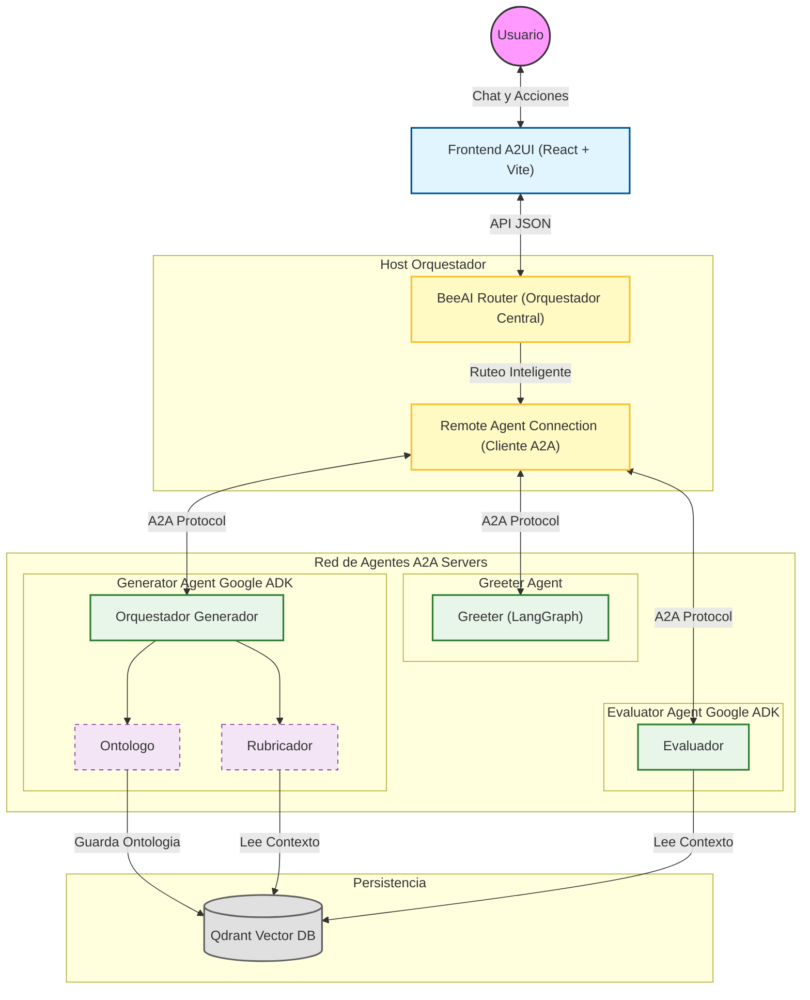

# RubricAI - Sistema Multi-Agente de Rúbricas (A2A)

Este sistema implementa una arquitectura **Multi-Agente (A2A)** orquestada por **BeeAI Router**, diseñada para la generación y evaluación de rúbricas de cumplimiento normativo utilizando Inteligencia Artificial Generativa y RAG (Retrieval-Augmented Generation).

## 🧠 Arquitectura del Sistema

El sistema se compone de un Orquestador central y varios Agentes especializados que se comunican a través del protocolo **A2A (Agent-to-Agent)** sobre HTTP.

### Diagrama de Arquitectura



## 🤖 Descripción de los Agentes

### 1. 🐝 BeeAI Router (Orquestador)
*   **Tecnología**: [BeeAI Framework](https://github.com/i-am-bee/beeai-framework) + Google Gemini de orquestador.
*   **Rol**: Es el cerebro central del sistema. No realiza tareas por sí mismo, sino que analiza la intención del usuario y "enruta" la solicitud al agente especializado correspondiente.
*   **Funcionamiento**: Utiliza un modelo ReAct para decidir qué herramienta (agente remoto) invocar basándose en la descripción semántica de cada agente.

### 2. 👋 Greeter Agent (Bienvenida)
*   **Tecnología**: [LangGraph](https://langchain-ai.github.io/langgraph/).
*   **Puerto**: `10003`
*   **Rol**: Agente conversacional ligero encargado de dar la bienvenida, explicar el propósito del sistema y guiar al usuario en sus primeros pasos.
*   **Personalidad**: Amigable, entusiasta y servicial.

### 3. 📝 Generator Agent (Generador de Rúbricas)
*   **Tecnología**: [Google ADK (Agent Development Kit)](https://github.com/google/generative-ai-python).
*   **Puerto**: `10001`
*   **Rol**: Genera instrumentos de evaluación complejos basándose en normativas.
*   **Sub-Agentes**:
    *   **Ontólogo**: Analiza documentos normativos (PDFs), extrae entidades y relaciones semánticas, y las guarda en Qdrant.
    *   **Rubricador**: Consulta la base de conocimiento (Qdrant) para recuperar el contexto normativo y redacta la rúbrica detallada en Markdown.

### 4. ⚖️ Evaluator Agent (Evaluador)
*   **Tecnología**: Google ADK.
*   **Puerto**: `10002`
*   **Rol**: Realiza auditorías de cumplimiento. Compara un documento proporcionado por el usuario contra una rúbrica específica y el contexto normativo institucional.
*   **Capacidades**:
    *   Lectura de documentos (PDF).
    *   Búsqueda de contexto normativo en Qdrant (`buscar_contexto_para_evaluacion`).
    *   Generación de informes de retroalimentación constructiva.

## 📡 Protocolo A2A (Agent-to-Agent)

El sistema utiliza un protocolo de comunicación estandarizado basado en **JSON-RPC 2.0** sobre HTTP.

*   **Discovery**: El orquestador descubre las capacidades de los agentes consultando el endpoint `/.well-known/agent.json` de cada servicio.
*   **Mensajería**: Las interacciones se envían mediante el método `message/send`.
    ```json
    {
      "jsonrpc": "2.0",
      "method": "message/send",
      "params": {
        "message": {
          "role": "user",
          "parts": [{"type": "text", "text": "Hola"}],
          "contextId": "..."
        }
      },
      "id": "..."
    }
    ```

## 🛠️ Tecnologías Clave

*   **Backend**: Python, FastAPI/Starlette, `uv`.
*   **Frontend**: React, Vite, TailwindCSS.
*   **IA / LLM**: Google Gemini 2.5 Flash.
*   **Base de Datos Vectorial**: Qdrant (para almacenamiento de ontologías y RAG).
*   **Frameworks de Agentes**: BeeAI (IBM), LangGraph, Google ADK.
