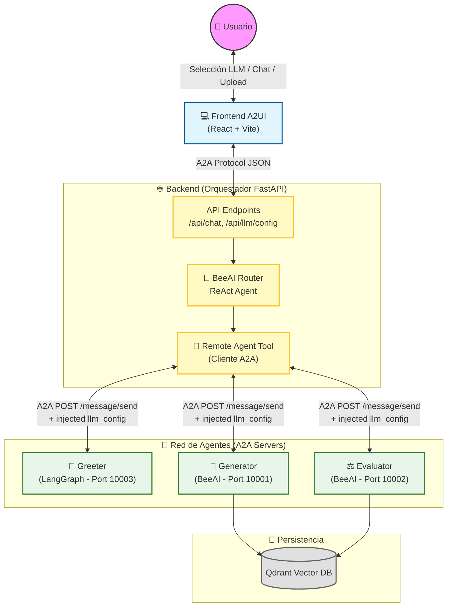

# AsistIAG - RubricAI: Sistema Multi-Agente de Rúbricas

**RubricAI** es la implementación técnica para el proyecto **AsistIAG** (Asistente Inteligente orientado a tareas del ámbito universitario), presentado por la Universidad de A Coruña. 

El sistema utiliza una arquitectura **Multi-Agente (A2A)** orquestada por **BeeAI Framework**, optimizada para la generación automática de rúbricas y la evaluación de cumplimiento basada en normativas, utilizando IA Generativa y RAG (Retrieval-Augmented Generation).

---

## 🎯 Cumplimiento de Especificaciones AsistIAG

El sistema ha sido diseñado y desarrollado centrándose tanto en aspectos técnicos como metodológicos, cumpliendo con las siguientes especificaciones:

✅ **Generación Automática de Rúbricas:** El agente `Generator` extrae criterios desde documentos normativos (ej. normativas de igualdad de género, memorias de títulos) y construye rúbricas detalladas.
✅ **Elaboración de Informes de Cumplimiento:** El agente `Evaluator` compara documentos docentes contra rúbricas validadas, produciendo informes de auditoría ágiles y coherentes.
✅ **Independencia de Modelos (NUEVO):** Integración de un catálogo dinámico (`llm_factory`) que permite al usuario seleccionar desde el Frontend entre múltiples proveedores y modelos (ej. **Groq Llama 3/4**, **Google Gemini 2.5/2.0**, **OpenAI GPT-4o**), evitando el acoplamiento a un solo vendor.
✅ **Independencia de Herramientas:** Uso de bases de datos vectoriales estándar (Qdrant) intercambiables.
✅ **Diseño Centrado en el Usuario (UI Transparente):** Interfaz frontend limpia en React, donde el usuario interactúa en lenguaje natural. Los detalles técnicos (cambios de agente, llamadas RAG) ocurren en segundo plano y se muestran sutilmente mediante badges y loaders.
✅ **Optimización de Procesos Académicos:** Interfaz orientada a flujos específicos (generación, evaluación) que reduce el tiempo administrativo.

---

## 🧠 Arquitectura del Sistema

El sistema se compone de un Orquestador central y varios Agentes especializados que se comunican a través del protocolo **A2A (Agent-to-Agent)** sobre HTTP.

### Esquema Frontend - Backend - Agentes

---

## 🛠️ Orquestación y Uso de Tools con BeeAI

El núcleo del sistema es el **BeeRouter**, construido sobre `beeai-framework`. Funciona utilizando el patrón **ReAct (Reason + Act)**:

1. **Recepción de la intención**: El usuario envía un mensaje desde el Frontend (ej. *"Quiero evaluar esta guía docente"*).
2. **Razonamiento (BeeAI ReAct Agent)**: El Orquestador recibe el mensaje y, usando un LLM configurado dinámicamente, razona sobre qué acción tomar.
3. **Uso de Tools (RemoteAgentTool)**: 
   - Los agentes remotos (`Greeter`, `Generator`, `Evaluator`) se exponen al Orquestador como **Tools** (Herramientas).
   - El Orquestador lee las descripciones de las tools y decide llamar a la tool `Evaluator`.
4. **Ejecución y Respuesta**: La tool hace una petición HTTP POST (`/message/send`) al agente remoto enviando el payload JSON. El agente remoto procesa, usa RAG (Qdrant) si es necesario, y devuelve la respuesta.
5. **Renderizado Frontend**: El Orchestrator emite metadatos (`action_request`) al Frontend, quien decide qué componente UI mostrar (ej. el modal de subida de archivos `RubricEvaluator.jsx`).

### Selección Dinámica de LLM

Gracias a la implementación reciente, el sistema intercepta las configuraciones de LLM desde el Frontend (`/api/llm/config`) y las inyecta en los payloads A2A. Los agentes usan una fábrica (`common.llm_factory`) para instanciar dinámicamente el adapter correcto de BeeAI (`GroqChatModel`, `GeminiChatModel`, `OpenAIChatModel`) según la elección del usuario, garantizando total independencia del proveedor subyacente.

---

## 💻 Stack Tecnológico

*   **Backend / Orquestación**: Python 3.13, FastAPI, Uvicorn, `uv`.
*   **Frameworks de Agentes**: BeeAI Framework (Principal), LangGraph.
*   **Frontend**: React 19, Vite (5.0.0), TailwindCSS, Framer Motion, Lucide Icons.
*   **IA / LLM**: Groq (Llama), Google Gemini, OpenAI (Configurables vía UI).
*   **Base de Datos Vectorial**: Qdrant (Almacenamiento de ontologías y RAG).

---

## 🚀 Inicio Rápido (Desarrollo local)

El proyecto utiliza `uv` para la gestión de dependencias de Python y `npm` para el frontend.

1. **Variables de Entorno**: Configurar el archivo `.env` en la raíz (ver `.env.example`).
2. **Iniciar Vector DB**: `docker run -p 6333:6333 qdrant/qdrant`
3. **Iniciar Agentes (Terminal 1)**: `npm run agents:all`
4. **Iniciar Frontend y Orquestador (Terminal 2)**: `npm run dev`
