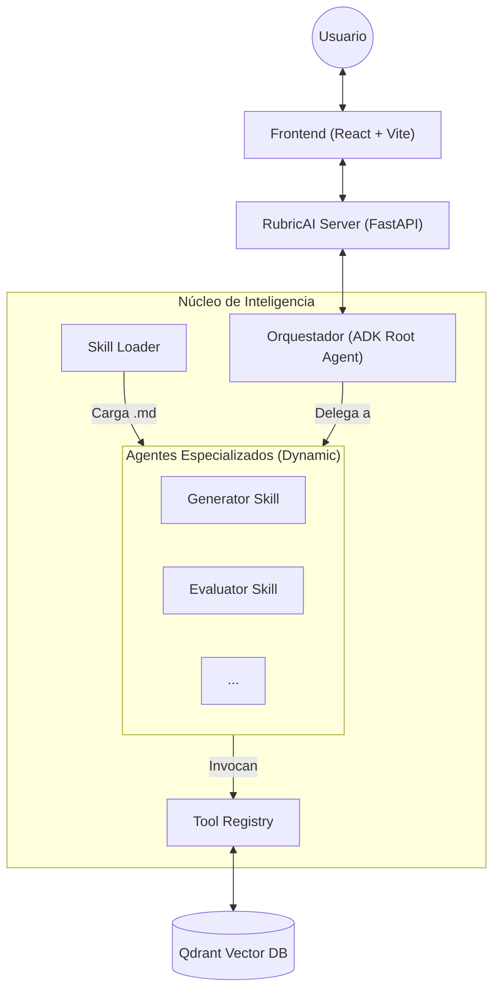

# RubricAI - Sistema de Rúbricas Inteligente (Google ADK)

RubricAI es un sistema avanzado diseñado para la **generación, evaluación y corrección de rúbricas** de cumplimiento normativo utilizando Inteligencia Artificial (Google Gemini) y RAG (Retrieval-Augmented Generation).

A diferencia de versiones anteriores, este sistema utiliza una arquitectura **unificada basada en Skills**, donde cada agente especializado se carga dinámicamente como una "habilidad" del orquestador central.

## 🚀 Arquitectura del Sistema (Skills-Based)

El sistema se ejecuta en un único servidor (FastAPI) que utiliza el **ADK (Agent Development Kit)** de Google para gestionar un agente orquestador y sus respectivos sub-agentes (skills).

### Diagrama de Funcionamiento



## 🧠 Funcionamiento de las Skills

El sistema permite cargar agentes de forma dinámica sin necesidad de reiniciar el servidor. Cada skill se define en una carpeta dentro del directorio `skills/`.

### Estructura de una Skill (`SKILL.md`)
Cada habilidad es un archivo Markdown con **Frontmatter YAML** que define su configuración:

```yaml
---
name: evaluador-de-cumplimiento
description: Evalúa documentos PDF contra una rúbrica específica.
model: gemini-2.5-flash
tools:
  - leer_rubrica_subida
  - leer_documento_subido
  - buscar_contexto_qdrant
---
# Instrucciones del Agente
Eres un experto en auditoría...
[Aquí van las directivas detalladas para el modelo]
```

### Carga Dinámica (`skill_loader.py`)
El `skill_loader` lee estos archivos, procesa las instrucciones y herramientas, y genera automáticamente instancias de `google.adk.agents.Agent`. Si una skill requiere sub-agentes adicionales (L2), estos se definen en el mismo archivo bajo secciones `## sub_agent:`.

## 🛠️ Registro de Herramientas (External Tools)

Las habilidades no tienen acceso directo al sistema operativo o bases de datos por seguridad. Utilizan un **Registro Central de Herramientas** definido en `app/qdrant_service.py` (`TOOL_REGISTRY`).

### Herramientas Disponibles:
*   `leer_rubrica_subida(rubric_id)`: Recupera el texto de una rúbrica cargada por el usuario.
*   `leer_documento_subido(document_id)`: Extrae texto de un PDF para su evaluación.
*   `buscar_contexto_qdrant(consulta)`: Realiza búsquedas vectoriales (RAG) para obtener contexto normativo indexado.
*   `guardar_ontologia_en_qdrant(ontologia_json)`: Guarda entidades y relaciones extraídas en la base de datos vectorial.

Para usar una herramienta, simplemente se debe listar su nombre en el campo `tools:` del frontmatter del `SKILL.md`.

## 🖥️ Integración con la Interfaz (UI Tags)

El sistema utiliza etiquetas especiales en las respuestas de texto de los agentes para activar componentes específicos en el frontend:

*   `[UI:RubricGenerator]`: Activa el panel de generación de rúbricas.
*   `[UI:RubricEvaluator]`: Activa el panel de subida de rúbrica y documento para evaluación.

Estas etiquetas permiten que la conversación fluya naturalmente hacia acciones concretas en la web.

## 🛠️ Tecnologías Clave

*   **IA / LLM**: Google Gemini 2.5 Flash.
*   **Agent SDK**: Google ADK (Agent Development Kit).
*   **Backend**: Python 3.12+, FastAPI, `uv`.
*   **Base de Datos Vectorial**: Qdrant.
*   **Embeddings**: `gemini-embedding-001` (3072 dimensiones).
*   **Frontend**: React, Vite, TailwindCSS.

## 🏁 Cómo Ejecutar

1.  **Configurar Variables**: Crear un `.env` con `GOOGLE_API_KEY`, `QDRANT_URL` y `QDRANT_API_KEY`.
2.  **Iniciar Servidor**:
    ```bash
    python -m app.server
    ```
3.  **Iniciar Frontend**:
    ```bash
    cd frontend && npm install && npm run dev
    ```
