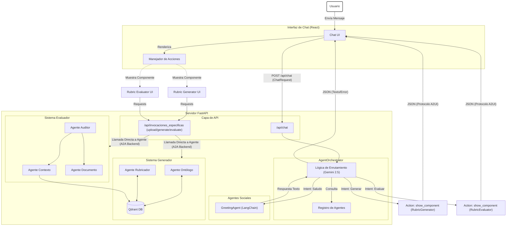

# Arquitectura de Agentes y Protocolos

Este diagrama ilustra la arquitectura A2A (Agent-to-Agent) implementada en el sistema RubricAI.

## Protocolo de Comunicación (A2A)

El sistema utiliza un protocolo definido en `a2a_protocol.py` para estandarizar la comunicación.

### Estructura del Mensaje (`AgentMessage`)

| Campo | Tipo | Descripción |
|-------|------|-------------|
| `source` | `str` | ID del agente emisor (ej. "orchestrator") |
| `target` | `str` | ID del agente receptor (ej. "user") |
| `type` | `Enum` | Tipo de mensaje (`text`, `action_request`, `error`) |
| `content` | `str` | Contenido legible para el usuario |
| `metadata` | `dict` | Datos estructurado para la UI (ej. `{"component": "RubricGenerator"}`) |

### Tipos de Mensaje Principales

1.  **`text`**: Mensaje de respuesta estándar (chat).
2.  **`action_request`**: Instrucción para que el Frontend realice una acción (ej. mostrar un componente UI específico).
3.  **`error`**: Notificación de fallo en el procesamiento.

### Flujo de Orquestación

1.  **Entrada**: El Orquestador recibe el mensaje del usuario.
2.  **Análisis**: Usa un LLM para determinar la intención y seleccionar el agente del registro.
3.  **Enrutamiento**:
    *   Si es un agente "Social" (ej. Greeter), lo invoca directamente y devuelve su respuesta.
    *   Si es una "Herramienta Compleja" (Generador/Evaluador), devuelve un `action_request` para que el Frontend active la interfaz correspondiente.
